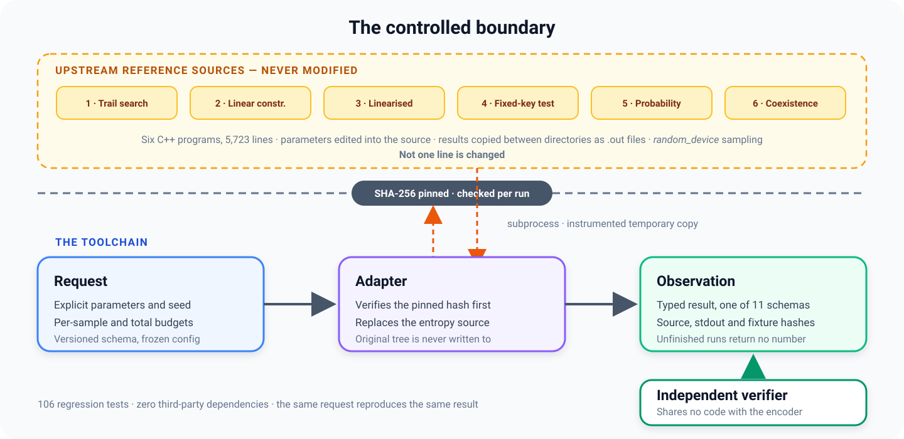

# Cryptanalysis toolchain

Cryptanalysis code published with a paper usually works, and it is worth
keeping. It just cannot be scripted, checked for regressions, or called from
anything larger. Each program keeps its parameters as constants in the source,
so changing one means a rebuild. Each stage writes its output to a file, and
getting that file to the next stage means copying it by hand. One stage draws
its random samples from an unrecorded source, so no two runs match.

This project wraps that code instead of rewriting it. Parameters become fields
in a request file. Stages pass typed messages that carry a version number. Every
run records the SHA-256 of the program it ran and of the files it read. A
separate checker re-derives the answer without sharing any code with the part
that produced it.

The original stays where it is, unchanged and read-only. A researcher keeps
working in their own copy and never has to touch this repository. If they change
it, the recorded hash stops matching and the run fails, instead of quietly
handing you an answer from a different program. The result is a working GIFT-64
pipeline: the same programs, run from a script, giving the same answer every
time.

<p align="center">
  
</p>

**Stack:** Python 3.10+, standard library only · C++ reference programs, read and instrumented · CryptoMiniSat 5.14.7 and a C++ compiler, for the integration tests

## Snapshot

| | |
| --- | ---: |
| C++ programs wrapped, none edited | 6 (5,723 lines) |
| Message types between stages | 11 |
| Tests | 106 |
| Packages you need to install | 0 |
| Trail records parsed and normalised | 32 |
| Python versions tested in CI | 3.10 – 3.13 |

## What changes, and what does not

This project never edits the original programs. A wrapper sits around each one
and turns what used to be a manual step into something it writes down.

| Before | After |
| --- | --- |
| Parameters sit in the source as constants | You fill in fields in a request file |
| Stages hand files to each other through folders | Stages pass typed messages with a version number |
| Random samples come from an unrecorded source | You give a seed, and the same request picks the same samples |
| One key and one trail are fixed in the code | You choose them: 8 keys for a quick run, 1,000 for a full one |
| A run goes until it ends | Every run has a sample limit and a total limit |
| It prints a number even when it did not finish | If it did not finish, you get "not started" — not a number |
| Nothing re-checks the solver's answer | A separate checker re-derives it, sharing no code with the encoder |

See [design notes](docs/design.md) for the full rationale.

## Quick start

The test suite has no third-party dependencies and needs no external tools.

```bash
git clone https://github.com/Yuano0o/cryptanalysis-toolchain
cd cryptanalysis-toolchain
PYTHONPATH=src python3 -m unittest discover -s tests -t .
```

```text
Ran 106 tests in 0.009s
OK (skipped=8)
```

The 8 skipped tests are the ones that compile and run the C++ programs. They need
the reference sources, a compiler and CryptoMiniSat. When those are missing they
skip — they do not quietly pass. You can also run any single stage:

```console
$ PYTHONPATH=src python3 scripts/inspect_gift64_linear_constraints.py
{
  "adapter_version": "gift64-lc-legacy-adapter/v1",
  "constraint_set_count": 32,
  "constraint_set_schema_version": "constraint-set/v1",
  "equation_count": 192,
  "legacy_stdout_sha256": "b03a368c3128edf7042f57a9609822be968a324e7163f38c933782c779412a13",
  "rank_total": 192,
  "rank_values": [6],
  "source_sha256": "42f734a6cc7969a55fca5ad498ae319c2676fe4c6e3178ff633efa6295df7bd2",
  "trail_source_sha256": "fe40ca7b81d4c362d45db58c7c4448317d0305bbd149e04abe12bcede8c02335"
}
```

Three hashes in one result: the program that ran, the output it printed, and the
input file it read. That is enough to find the exact inputs behind any number
here.

## What is checked, and what is not

| Checked | How |
| --- | --- |
| A four-round GIFT-64 SAT result | decoded and re-derived by a separate checker |
| 32 trail records | turned into rank-6 GF(2) spaces, then rank-8, with every original basis still implied |
| Every stage run | same seed, capped budget, hashes recorded |
| The whole pipeline | seven written acceptance criteria, checked by review, by a real test run, and by its own output |
| The SAT baseline | audited separately, and passed for the uses listed there |

This project does not claim that any trail or bound is optimal, that it
reproduces the published paper-scale results, that it makes the solver faster,
or that machine learning contributes anything to the numbers above.

## Status

| Area | Status |
| --- | --- |
| SAT baseline | complete |
| GIFT-64 pipeline, stages 1–5 | complete |
| Trail coexistence, 18/19-round construction | blocked — generator artifacts absent upstream |
| ML-guided candidate ranking | blocked — prior-work source and data unavailable |
| CRAFT / WARP portability | deferred |

Every document uses the same fixed set of status words, so "finished", "usable"
and "stuck" never blur into each other.

## Repository structure

```text
.
├── src/
│   ├── automated_differential_analysis/   stages, formats, legacy adapters
│   ├── ml_guided_sat/                     optional learned guidance
│   └── shared/                            SAT contracts, GF(2) constraints, ciphers
├── adapters/        interfaces to the upstream reference implementations
├── benchmarks/      benchmark definitions and test vectors
├── configs/         reproducible configurations
├── docs/            design notes, per-stage analysis, project status
├── experiments/     experiment manifests per cipher
├── scripts/         inspection and demo entry points
└── tests/           unit, integration, and regression tests
```

The reference programs are never copied into this repository. Generated output,
solver logs and binaries are kept out of Git.

## Documentation

- [Design notes](docs/design.md) — the boundary, contracts, determinism, verification
- [References](docs/references.md) — papers and reference implementations this builds on
- [Project status](docs/current_analysis/project_status.md) — progress, next actions, blockers
- [SAT baseline](docs/current_analysis/sat_baseline.md) — scope and acceptance criteria
- [Credibility audit](docs/current_analysis/sat_baseline_audit.md) — what the baseline supports
- [Pipeline acceptance](docs/current_analysis/gift64_pipeline_acceptance_a1_a5.md) — the seven criteria
- [Engineering rules](docs/ENGINEERING_RULES.md) — working rules this repository follows

## License

Released under the [MIT License](LICENSE).
